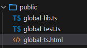
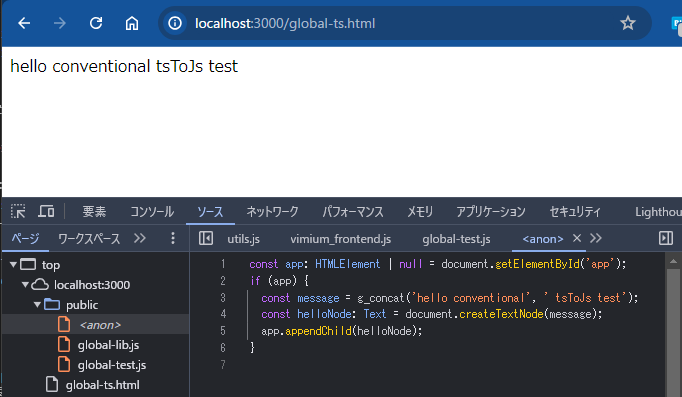

# TypeScripファイルをjsに変換してブラウザへ返すexpressミドルウェア

## はじめに

htmlでは、通常通りにjsを読み込んでいますが、
```html
    <div id="app"></div>
    <script src="./public/global-lib.js"></script>
    <script src="./public/global-test.js"></script>
```
実はサーバー側はTypeScriptのファイルしかおいていないので、Webサーバー(Express)が動的にjsにトランスパイルして返す、というミドルウェアを作りました



利用方法：静的ファイルを返すexpress.static()の直前に読み込むと
  * js/tsファイルのリクエストを受け取り、tsファイルを読み込む
  * ファイルをトランスパイルしてブラウザに返す
```js
app.use(tsToJs('public')); // ts->js変換ミドルウェア
app.use(express.static('public'));
```

実行すると下記のようにTypeScriptのソースが表示されます。

(ソースマップ付きでトランスパイルをしているので、元ソースをもとにデバッグをすることができます)



### 動機

TypeScriptで書きたいけど、Reactとかフレームワークを使いたくないという場合は自分でトランスパイルする環境をそろえる必要があります

ただ、下記のように従来型のjs開発に組み込みづらくなってしまいました
* ライブラリjsの読み込み＋画面毎に読み込むjsファイルを別々に分けたい、ということがやりづらくなった
* (webpack全盛期から考えると楽になりましたが)トランスパイル＋バンドルの仕組みを整えるのは大変


例：下記のように共通ライブラリ＋画面毎のjsファイルに分割していた場合、bundleの単位を画面毎に行う必要があり面倒

* page1.html
```html
<script src="./lib.js"></script>
<script src="./page1.js"></script>
```

* page2.html
```html
<script src="./lib.js"></script>
<script src="./page2.js"></script>
```


TypeScriptだとそのまま読み込めないので、ページ毎にバンドルする必要がある(ページ毎にビルドを行う？)
```html
<script type="module" src="./bundle-page1.js"></script>
```
```html
<script type="module" src="./bundle-page2.js"></script>
```


そこで、ブラウザからjsファイルのアクセスがあった際に、自動的にtsファイルを探してトランスパイルをするexpressのミドルウェアがないか？と探してみました。

が、見つからなかったので、自分で作ってみました。

## 簡単な仕組みの説明

* ブラウザから`.js` or `.ts`ファイルのリクエストがあった場合、拡張を`.ts`に変えたファイルを探し、`.js`にトランスパイルして返す
* 上記以外のリクエストはexpress標準の`express.static()`にお任せする(.html等)

※ブラウザから`.ts`のアクセスは通常は発生しなさそうですが、`.ts`ファイルをimportしているとブラウザが取りに来ます(バンドルはしていないため、リクエストが発生する)


```typescript
import { concat } from './lib.ts';
const moji = concat('aaa', 'bbb');
```

またTypeScriptの仕様ではimport時に拡張子は不要なのですが、拡張子をつけておかないとブラウザが読み込みエラーになってしまうので拡張子をつけています

## 使い方

### パターン①：importを利用しないTypeScriptファイル(グローバルに関数を定義)を複数読み込む
   * htmlファイルに&lt;script&gt;タグを複数配置して(.tsファイルを)読み込むやり方

ライブラリ側：グローバルにアクセスできる共通関数を定義する

```typescript:global-lib.ts
function g_concat(a: string, b: string): string {
  return a + b;
}
```

html側で読み込んで、共通関数を利用するソース
```typescript:global-lib.ts
const app: HTMLElement | null = document.getElementById('app');
if (app) {
  const message = g_concat('hello conventional', ' tsToJs test');
  const helloNode: Text = document.createTextNode(message);
  app.appendChild(helloNode);
}
```

jsファイルを読み込むhtmlファイル

* jsファイルを読み込んでいるが、サーバ上ではtsファイル

```html:global-ts.html
  <body>
    <div id="app"></div>
    <script src="./public/global-lib.js"></script>
    <script src="./public/global-test.js"></script>
  </body>
```

### パターン②：importを利用したTypeScriptファイルを利用
   * htmlファイルに1つだけ&lt;script&gt;タグを配置し、他ファイルは`import`で読み込むやり方

ライブラリ側：共通関数をexportする
```typescript:import-lib.ts
export function i_concat(a: string, b: string): string {
  return a + b;
}
```

html側で読み込んで、共通関数を利用するソース
```typescript:import-lib.ts
import { i_concat } from './import-lib.ts';
const app: HTMLElement | null = document.getElementById('app');
if (app) {
  const message = i_concat('hello module', ' tsToJs test');
  const helloNode: Text = document.createTextNode(message);
  app.appendChild(helloNode);
}
```
jsファイルを読み込むhtmlファイル

* jsファイルを読み込んでいるが、サーバ上ではtsファイル
```html:import-ts.html
  <body>
    <div id="app"></div>
    <script type="module" src="./public/import-test.js">
    </script>
  </body>
```


## TypeScripファイルをjsに変換するExpressミドルウェアソース

* トランスパイルを行うため[SWC](https://github.com/swc-project/swc)を利用しています
* 拡張子が(.js|.ts)の場合、同名の.tsファイルを取得して動的にトランスパイルを行い、ブラウザへ返しています

```javascript:tsToJs.js
/**
 * .jsと同じファイル名の.tsファイルをトランスパイルしてクライアント側に返す
 * expressのミドルウェア関数
 */
import fs from 'fs';
import path from 'path';
import { transform } from '@swc/core';

// tsからjsへ変換する際の定義
const transform_config = {
  jsc: {
    parser: {
      syntax: 'typescript',
    },
    target: 'es5',
  },

  sourceMaps: 'inline', //jsファイル内にソースマップを保持
};

/**
 * .jsと同じファイル名の.tsファイルをトランスパイルしてクライアント側に返す
 * @param {string} root
 * @returns
 */
const tsToJs = (root) => {
  const regexp = new RegExp(`${root}/.*\.[jt]s$`, 'i');
  /**
   * @type  {import("express")}
   * @param {Express.Request} req
   * @param {Express.Response} res
   * @param {import('express').NextFunction} next
   */
  const tsToJsHandler = async (req, res, next) => {
    // .tsファイル存在チェック(無ければ次のmiddlewareへ)
    if (!regexp.test(req.path)) {
      // `${root}/.*\.js`にマッチしないパスはexpress.static()に任せる
      return next();
    }

    const filename = req.path.replace('.js', '.ts');
    const filePath = path.join(path.resolve(), filename);
    if (!fs.existsSync(filePath)) {
      return next();
    }

    try {
      // .tsファイルをトランスパイルして返す(bundleはしない)
      const tsSource = fs.readFileSync(filePath, 'utf8');
      const { code } = await transform(tsSource, transform_config);
      res.type('.js');
      res.send(code);
    } catch (err) {
      next(err);
    }
  };
  return tsToJsHandler;
};

export default tsToJs;

```

## 利用方法

expressをインストール
```
npm init -y
npm i express
```

main.jsファイルを作成し、以下のコードを書き込む
```js:main.js
import express from 'express';
import tsToJs from './tsToJs.js';

const app = express();

app.use(express.json());
app.use(express.urlencoded({ extended: true }));
app.use(tsToJs('public')); // ts->js変換ミドルウェア
app.use(express.static('public'));

app.listen(3000, () => console.log(' listening on port 3000.'));
```

node.jsで実行する

```
$ node main.js
 listening on port 3000.
```


